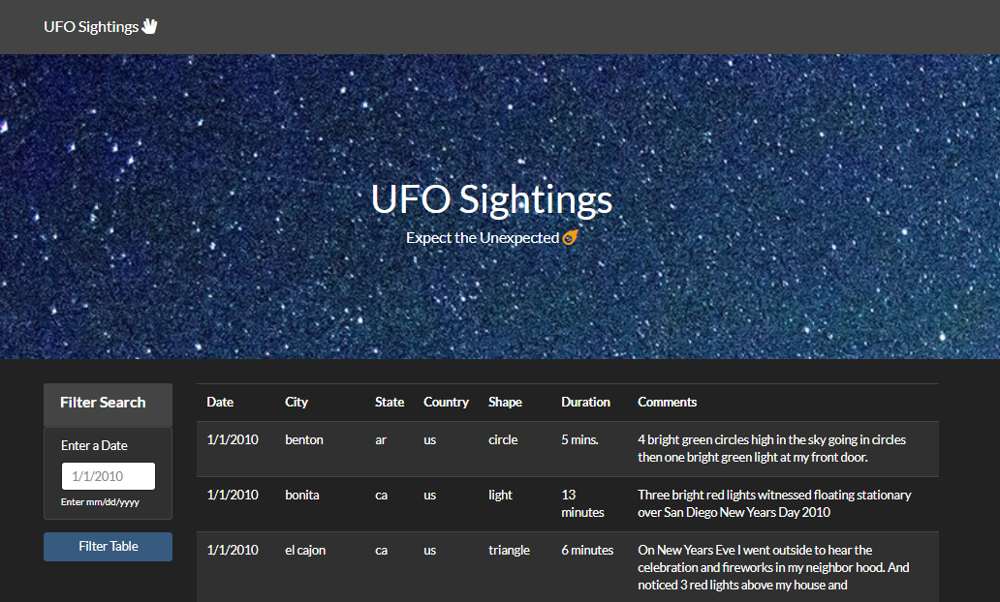
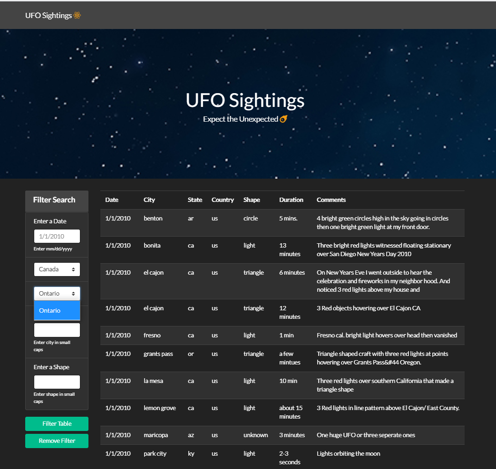

# javascript-challenge
 Jamie Tan Javascript challenge submission

### Background of the challenge:

Let's add some user interactivity to our data visualisation! To tackle the common problem of serving meaningful data to users when the data collection is too large for manual searching, we have created a webpage with a JavaScript app that dymanically filters a dataset based on user inputs. Coding languages used are JavaScript, HTML, CSS and D3.js.

<strong>Level 1</strong> challenge requires building the webpage with a JavaScript app that appends the dataset in a table and allows users to earch through the date/time column to find rows that match user input.

<strong>Level 2</strong> challenge takes it further by enabling multiple search categories.

I have conquered both levels. :sweat_smile::alien: 

### Level 1

* Custom web page

* Javascript code to append a table of :alien: sightings to the web page and adds new rows of data from dataset provided.

* Javascript code to search through 'date/time' column and find rows that match user input.

* Website is built to be responsive using bootstrap.

### Level 2

The webpage has all the functionalities of Level 1, with the following additions:

* Multiple search categories on the following search criterias:
  1. date/time
  2. country
  3. state
  4. city
  5. shape

* Dynamic dropdown options where options for 'state' is dependent on 'country' selection

* Button to unfilter table and clear input/selection

* Back to top button for easier page navigation

### Files (in each UFO-level-1 and UFO-level-2 folders):
1. JavaScript app (filename: app.js; in folder 'static' and subfolder 'js')
2. JavaScript data (filename: data.js; in folder 'static' and subfolder 'js')
3. HTML template (filename: index.html)
4. CSS files (filename: bootstrap_darkly.css and style.css)
5. Images (in folder 'static' and subfolder 'images')
